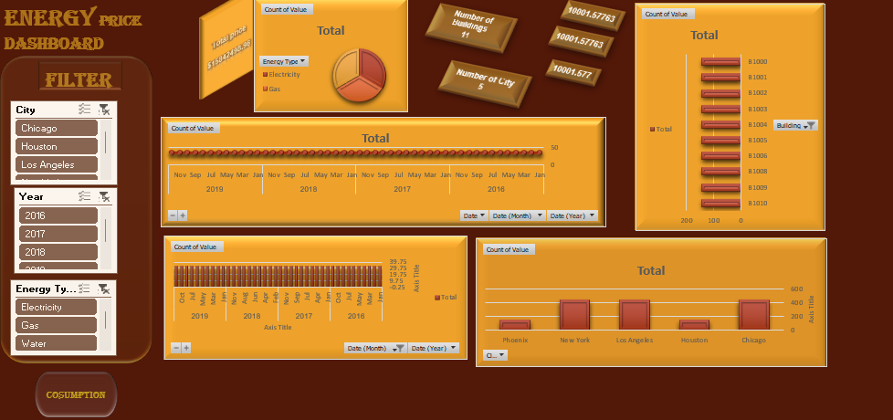

# Energy Consumption Analysis

Analyzed 4 years of energy consumption data (2016–2019)
across 11 buildings in 5 US cities.

## Key Findings
- New York had the highest Water & Gas consumption
- Los Angeles led in Electricity consumption
- Building B1006 was the top Water consumer
- Energy prices increased 46% from 2016 to 2020
- Peak consumption was in 2017

## Tools Used
- Excel | Pivot Tables | Slicers | Charts

## Dashboard Preview

